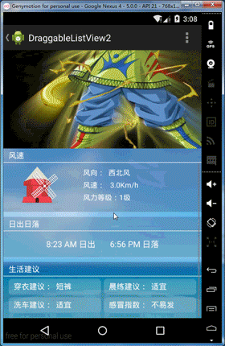

DraggableLinearListView
=================
以LinearLayout为基础构造了三个自定义控件，方便大家使用。

[  ](https://bintray.com/ls1110924/maven/DraggableLinearListViewLib/_latestVersion)

## DEMO


## Why
这是在写东西的过程中的一个特殊的需求，要实现一个列表，但是每一个item都是不同布局的，同时这些item之间是可以长按拖动排序。当然可以使用DraggableListView这个
Git上已经成熟的库来做，但是我感觉使用一个ListView来实现有些小题大做；其次如果用LinearLayout来做，子items可以由LinearLayout保持强引用，子视图可以服用，
刷新的话，也只需要给这些子视图新的数据，让它们刷新即可。这样通过复用，节省创建开销，也同样能节省刷新开销(通过指定那些需要刷新的子视图即可)。

## Features
- 实现了Support包中可以添加分割线的LinearLayout，即DividerLinearLayout。
- 实现了可接受Adapter配置视图的DividerLinearLayout，即LinearListView。
- 以LinearListView为基础，实现了可拖拽子视图的DraggableLinearListView。

## How to use

```groovy
repositories {
    jcenter()
}

dependencies {
	compile 'com.github.ls1110924.library:draggable-linear-listview:1.0.0'
}
```